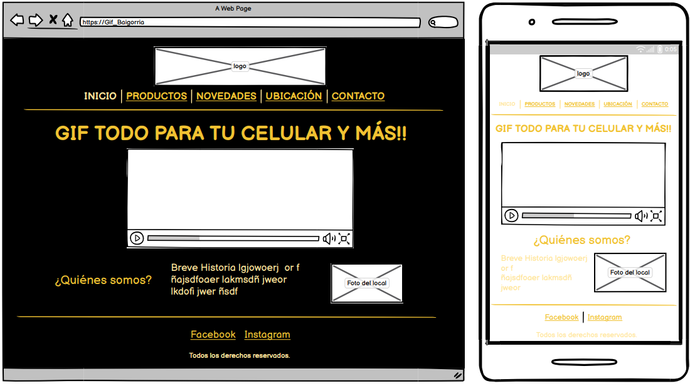
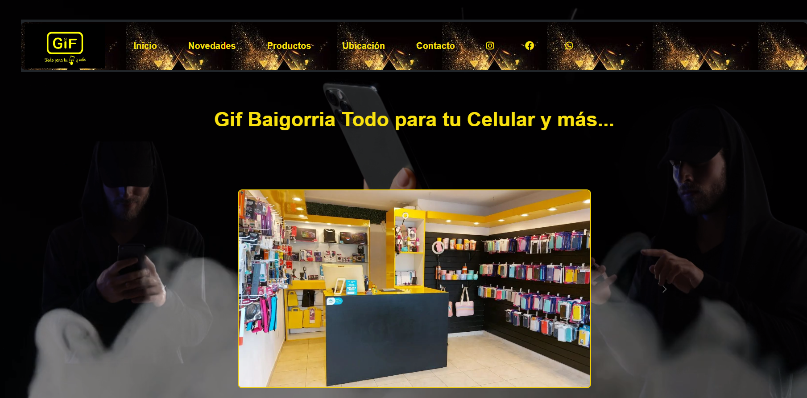

 # Mi primer Proyecto "Gif" 

"Este proyecto se centra en una Pyme familiar que comenzó durante la pandemia y que, en la actualidad, opera tres sucursales plenamente funcionales.

Al embarcarme en este extenso viaje de estudio y desarrollo, asumí el compromiso de crear este Sitio Web como parte de mi formación académica.

Partiendo del wireframe inicial que proporcioné, realicé múltiples cambios hasta llegar al resultado final que hoy parece increíble. Esto ha sido posible gracias al apoyo y orientación constante de mis profesores y mi tutor a lo largo de todas mis presentaciones."

## Características Destacadas

### Primera Presentación: Maqueta del Proyecto y mi primera versión 

## Capturas de Pantalla

*Descripción de la captura de pantalla 1*
### Segunda Presentación: sólo aplicando las primeras mejoras.

*Descripción de la captura de pantalla 2*

### Tercera presentación: Aplicando modelos para lograr una página responsive.
Utilizamos:
-   Box Modeling
-   Flexbox
-   Grids
-   Pseudoclases y Bem
-   Bootstrap

### Puesta Final: Ver tu proyecto en un servidor y ver todos los cambios que se fueron generando hasta quedar Increíble.

## Instalación
Puedes seguir estos pasos para instalar y ejecutar el proyecto en tu máquina local:

1. Clona el repositorio: `git clone https://github.com/ClauPopa/PFGif-Popa23.git`
2. Ve al directorio del proyecto: `cd PFGif-Popa23.git`
3. Instala las dependencias: `npm install`
4. Inicia la aplicación: `npm start`

### Tecnologías utilizadas:
•	HTML5
•	CSS3
•	SASS
•	Node.js
•	Bootstrap
•	AOS ANIMATIONS.
### Controlador de versiones
•	Git
•	GitHub
### Herramienta de desarrollo
•	Visual Studio Code
## Licencia

Este proyecto está bajo la Licencia MIT. 

MIT License

Copyright (c) [2023] [Claudia Maria Popa de los derechos de autor]

Se concede permiso, de forma gratuita, a cualquier persona que obtenga una copia
de este software y de los archivos de documentación asociados (el "Software"), para tratar
en el Software sin restricción, incluyendo sin limitación los derechos
para usar, copiar, modificar, fusionar, publicar, distribuir, sublicenciar y/o vender
copias del Software y para permitir a las personas a quienes se les proporcione el Software
lo hagan, bajo las siguientes condiciones:

El aviso de copyright anterior y este aviso de permiso se incluirán en todos
copias o partes sustanciales del Software.

EL SOFTWARE SE PROPORCIONA "TAL CUAL", SIN GARANTÍA DE NINGÚN TIPO, EXPRESA O IMPLÍCITA,
INCLUYENDO PERO NO LIMITADO A LAS GARANTÍAS DE COMERCIABILIDAD, ADECUACIÓN
PARA UN PROPÓSITO PARTICULAR Y NO INFRACCIÓN. EN NINGÚN CASO LOS AUTORES O LOS
TITULARES DE DERECHOS DE AUTOR SERÁN RESPONSABLES DE CUALQUIER RECLAMO, DAÑO U OTRO
RESPONSABILIDAD, YA SEA EN UNA ACCIÓN DE CONTRATO, AGRAVIO O DE OTRA MANERA, QUE SURJA DE,
FUERA DE O EN RELACIÓN CON EL SOFTWARE O EL USO U OTROS TRATOS EN EL
SOFTWARE.

